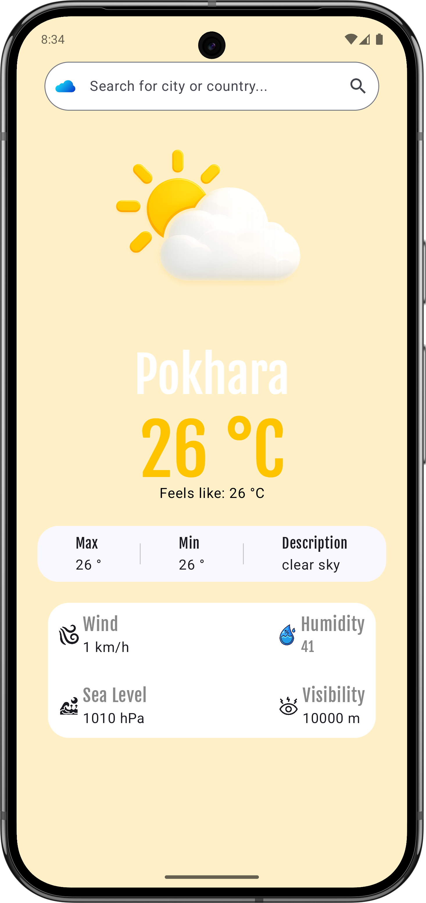
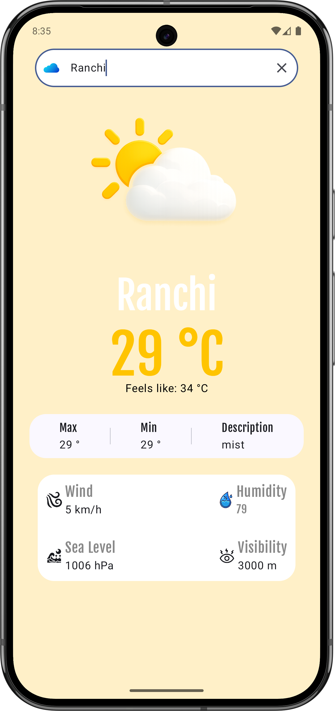

<div align="center">


\# ⚡ Indra


\*A clean and modern weather app built with Jetpack Compose.\*


</div>


<p align="center">

&#x20; 

&#x20; 

&#x20; 

&#x20; 

&#x20; 

&#x20; 

&#x20; 

</p>


\---


\## 📱 About Indra


\*\*Indra\*\* is a modern weather application built using \*\*Jetpack Compose\*\* that provides real-time weather information in a clean and simple UI.


The app allows users to search for any city and view important weather information like temperature, humidity, pressure, sea level, minimum and maximum temperature, and overall weather conditions.


The goal of this project was to build a stable, beautiful, and scalable weather app while following modern Android development practices like \*\*Clean Architecture\*\*, \*\*MVVM\*\*, and \*\*Dependency Injection\*\*.


\---


\## 📸 App Preview


<p align="center">

&#x20; 

&#x20; 

</p>


\---


\## ✨ Features


\- 🌤️ Real-time weather updates

\- 🔍 Search weather by city name

\- 🌡️ Current temperature information

\- 🔺 Maximum temperature

\- 🔻 Minimum temperature

\- 💧 Humidity tracking

\- 🌊 Sea level information

\- 🌥️ Weather condition details

\- ⚡ Fast and responsive UI

\- 🎨 Clean and modern design

\- 📱 Built fully with Jetpack Compose


\---


\## 🛠️ Tech Stack


\- \*\*Kotlin\*\*

\- \*\*Jetpack Compose\*\*

\- \*\*MVVM Architecture\*\*

\- \*\*Clean Architecture\*\*

\- \*\*Hilt (Dependency Injection)\*\*

\- \*\*Retrofit\*\*

\- \*\*OpenWeather API\*\*

\- \*\*Coroutines\*\*

\- \*\*State Management\*\*

\- \*\*Material 3\*\*


\---


\## 🏗️ Architecture


The app follows \*\*Clean Architecture\*\* with \*\*MVVM\*\* to keep the code clean, scalable, and easy to maintain.

\## 📂 Project Structure


```txt

app

│

├── presentation

│   ├── screens

│   ├── components

│   └── viewmodel

│

├── domain

│   └── model

│

├── data

│   ├── remote

│   │   ├── dto

│   │   ├── api

│   │   └── mapper

│   │

│   └── network

│

└── MainActivity.kt

```


\## ⚙️ How It Works


```mermaid

flowchart TD


&#x20;   A\[📱 User Opens App]

&#x20;   B\[🔍 Search City]

&#x20;   C\[🌐 Request Weather Data]

&#x20;   D\[☁️ OpenWeather API]

&#x20;   E\[📊 Weather Response]

&#x20;   F\[📱 Show Weather Details]


&#x20;   A --> B

&#x20;   B --> C

&#x20;   C --> D

&#x20;   D --> E

&#x20;   E --> F

```


\---


\## 🚀 Getting Started


\### Prerequisites


Before running the project, make sure you have:


\- Android Studio (Latest Stable Version)

\- JDK 17+

\- Android SDK

\- OpenWeather API Key

\- Internet Connection


\---


\## ⚙️ Installation


\### 1. Clone the Repository


```bash

git clone https://github.com/umesh-hamal/Indra.git

cd Indra

```


\### 2. Open in Android Studio


\- Open Android Studio

\- Click \*\*Open\*\*

\- Select the \*\*Indra\*\* project folder


\---


\### 3. Add API Key


Add your OpenWeather API key inside:


```properties

local.properties

```


Example:


```properties

OPEN\_WEATHER\_API\_KEY=your\_api\_key\_here

```


\---


\### 4. Sync Project


Let Gradle sync automatically.


Or run:


```bash

./gradlew build

```


\---


\## ▶️ Run the App


\### Run on Emulator


1\. Open Android Studio

2\. Start an Emulator

3\. Click \*\*Run ▶\*\*


\### Run on Physical Device


1\. Enable Developer Options

2\. Enable USB Debugging

3\. Connect your Android phone

4\. Click \*\*Run ▶\*\*


\---


\## 🔮 Future Improvements


\- 📍 Current location weather

\- 📅 7-day forecast

\- ⏰ Hourly weather forecast

\- 🌙 Dynamic weather backgrounds

\- 🔔 Weather alerts

\- ❤️ Save favorite cities


\---


\## 🤝 Contributing


Contributions, suggestions, and improvements are always welcome.


Feel free to fork the repository and create a pull request.


\---


\## 📜 License


This project is licensed under the MIT License.


\---


\## 👨‍💻 Developer


Built with ❤️ by \*\*Umesh Hamal\*\*


GitHub: https://github.com/umesh-hamal

